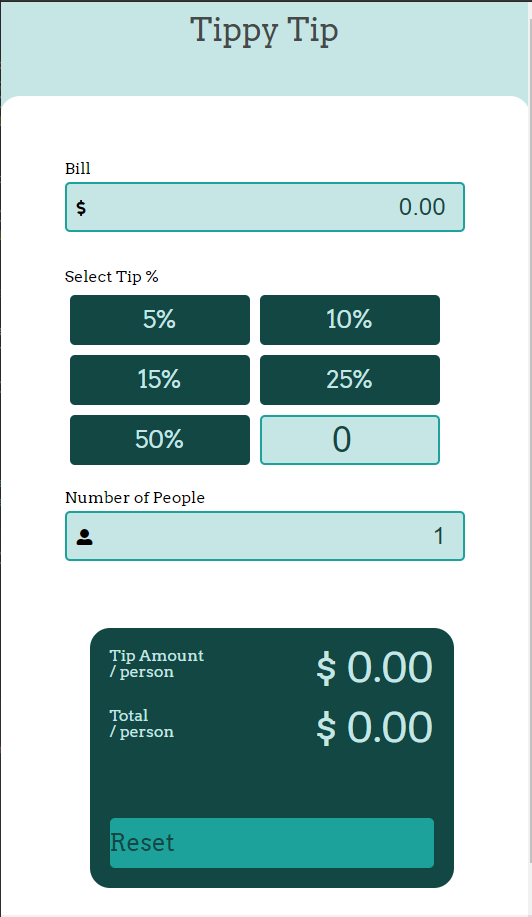
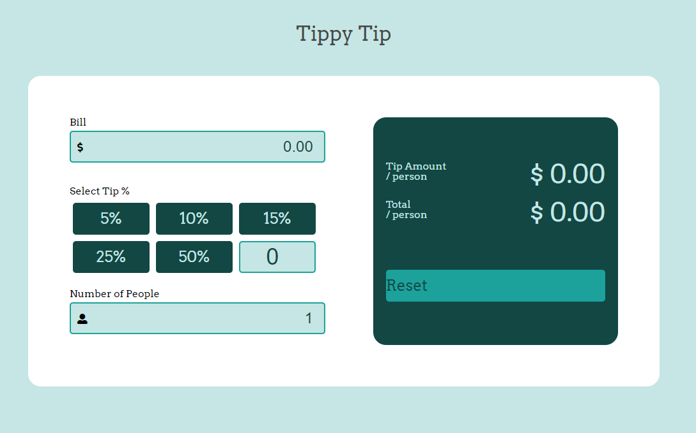

# Tippy Tip - v1 - Html, CSS, and JavaScript 

## Overview
Tippy Tip is a single tip calculator and bill splitter then can be accessed on the web. It was made with HTML, CSS and JavaScript

### The challenge

Users should be able to:

- View the optimal layout for the app depending on their device's screen size
- See hover states for all interactive elements on the page
- Calculate the correct tip and total cost of the bill per person

### Screenshot

Add a screenshot of your solution. The easiest way to do this is to use Firefox to view your project, right-click the page and select "Take a Screenshot". You can choose either a full-height screenshot or a cropped one based on how long the page is. If it's very long, it might be best to crop it.

Alternatively, you can use a tool like [FireShot](https://getfireshot.com/) to take the screenshot. FireShot has a free option, so you don't need to purchase it. 

Then crop/optimize/edit your image however you like, add it to your project, and update the file path in the image above.

**Note: Delete this note and the paragraphs above when you add your screenshot. If you prefer not to add a screenshot, feel free to remove this entire section.**

### Links

- Solution URL: [Add solution URL here](https://your-solution-url.com)
- Live Site URL: [Add live site URL here](https://your-live-site-url.com)

## My process

- Establish the goals and user stories
- Wirebox the HTML elements
- Style the the HTML elements with CSS
- Do as much of the validation in HTML as I can
- Plan out the JavaScript needs
- Add finish functionality from with JavaScript
- Test and add further validation

### Built with

- Semantic HTML5 markup
- CSS custom properties
- Flexbox
- Javascript

## Author
- Jason Dormier
- Github - [GitHub](https://github.com/JasonDormier)
- LinkedIn - [LinkedIn](https://www.linkedin.com/in/jasondormier/)
# tippy-tip-v1
